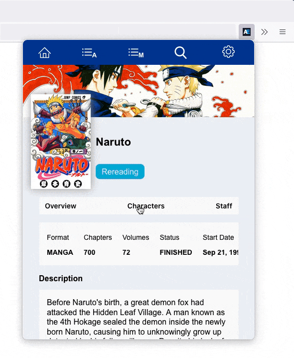
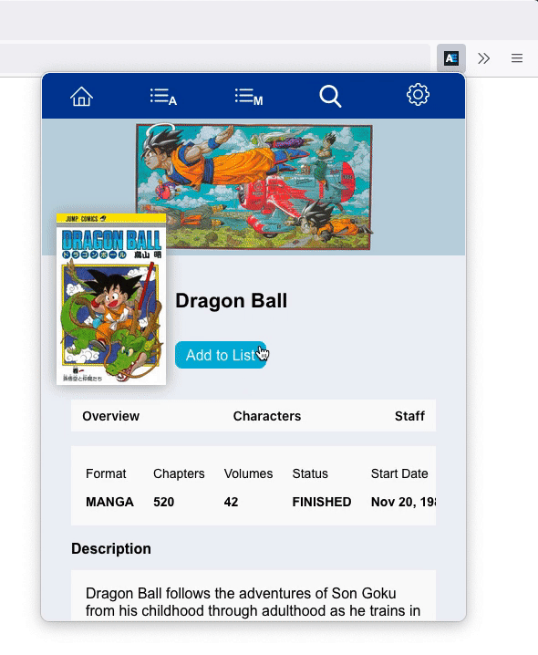

# Unofficial Anilist Extension


## Table of Contents

- [About the Project](#about-the-project)
- [Purpose and Goals](#purpose-and-goals)
- [Spotlight – Caching](#spotlight--caching)
  - [Pagination](#pagination)
  - [Refetching](#refetching)
  - [Manually Updating the Cache](#Manually-updating-the-cache)
- [Lessons Learned](#lessons-learned)
  - [Getting Comfortable With GraphQL](#getting-comfortable-with-graphQL)
  - [Why Using Vanilla JavaScript Was Trouble](#why-using-vanilla-javascript-was-trouble)
- [Future Improvements](#future-improvements)

## About the Project

"Unofficial Anilist Extension" is a browser extension that easily lets you update and view your lists on Anilist. [Anilist](https://anilist.co) itself is a website that acts as a public database for anime and manga. Their main feature is their "lists," which let you keep track of what you're watching, finished or plan to watch. The extension is built off of their [public GraphQL API](https://anilist.co/graphiql), which is very extensive.

The extension itself has all of the CRUD functionality; you can create, update, and delete list entries, and also view your entire list. It also features the full database of anime and manga, including pages for every anime or manga (hereafter referred to as media pages), and also every character and staff member. The media pages show all of the info about the media including: characters, staff, relations (adaptions, spin-offs, etc.), recommendations made by other users, and general data (start date, average score, etc.).

I completed this project on my own. Everything from creating the design in Figma, to writing the code, to building the final build. The current version was built using React, TypeScript, Apollo Client, and styled components, though the first several iterations were built with just vanilla JavaScript, CSS, and HTML. Those first versions also made extensive use out of custom elements/Web Components. The main branch is the Firefox version, but there is a Chrome version in the branch named "chrome."

## Purpose and Goals

The reason I built this project was because I wanted a way to more easily update list entries when I read a chapter of manga, since the actual Anilist website loaded slow and felt like a waste of time when I just wanted to click 1 button. So the first iteration of this extension was very simple; it just fetched what you were currently reading or watching, and when you clicked the update button, it updated the entry on their server. Over time I wanted it to do a lot more, so I redesigned it and added a lot of functionality. But after a while, the framework-less code became hard to understand, so I rewrote the whole thing with React and TypeScript. This also gave me the opportunity to use Apollo Client, which in some ways made my life easier, but also gave me a lot of trouble.

## Spotlight – Caching

With the React version, I now had the ability to easily add 3rd-party libraries to the project. So, I decided to use Apollo Client, since it seemed like the "go-to" in the React community for GraphQL. While it simplified querying and using data, it took me a long time to understand how to work with the cache. There were 3 specific things that caused me trouble.

### Pagination

The first was pagination, which I used pagination in a few places. On the media page, there are two tabs: one that lists all of the characters and another that lists the staff. These tabs are both paginated. I also used pagination of the actual character and staff pages to show their appearances and roles respectively. Here's a gif that shows pagination of the character tab:



<!-- explain the problem and why it existed -->

The pagination problem had two distinct parts. The first was that I didn't understand how to configure the type policy in `inMemoryCache`, and the second was that I had trouble writing the merge function in a way that didn't have any duplicate data.

<!-- type policy -->

The trouble with the type policy existed because of my flawed understanding of GraphQL and what the type policy actually was. I now know that the type policy is Apollo's way of customizing caching behaviour for each type. The `typePolicy` object is filled with objects that represent policies for each type you have. The key of these inner objects that is important for pagination is `fields`, which let you configure a _field_ policy for each field that exists on the type (i.e. write a merge function so that the field can be paginated). I didn't understand this when I started on this problem.

[The example in the documentation](https://www.apollographql.com/docs/react/pagination/core-api/#defining-a-field-policy) is what ended up confusing me, I think. It showed them put everything on the root `Query`, and their query was only one level deep. My query on the other hand, was nested. Here's one of the queries I was working with:

```gql
query GetCharacters($id: Int, $page: Int) {
  Media(id: $id) {
    id
    characters(page: $page, perPage: 25, sort: [ROLE, RELEVANCE, ID]) {
      edges {
        id
        # other fields
      }
      pageInfo {
        total
        currentPage
        hasNextPage
      }
    }
  }
}
```

<!-- explain the attempts and why you thought they'd work, and why the didn't -->

The field I was trying to paginate was `characters`. So, to start I copied the example from the docs and set about modifying it to my needs. My first idea was try nesting it like this:

```ts
const cache = new InMemoryCache({
  typePolicies: {
    Query: {
      fields: {
        Media: {
          characters: {
            keyArgs: false,
            merge(existing, incoming) {
              console.log('here');
            }
          }
        }
      }
    }
  }
});
```

This didn't work because it doesn't compile. I'm honestly not sure why I thought this would work.

Here is my second attempt:

```ts
const cache = new InMemoryCache({
  typePolicies: {
    Query: {
      fields: {
        characters: {
          keyArgs: false,
          merge(existing, incoming) {
            console.log('here');
          }
        }
      }
    }
  }
});
```

My thinking for this attempt was, "maybe `Query` is global and any fields that need to be paginated are defined underneath. Then the cache will be smart and use this whenever one of these fields are paginated." Again, this was wrong, and nothing printed to the console. I was starting to get really frustrated and started Google-ing, hoping to find a blog post or something with a clearer explanation. Eventually I found one, and I saw that they weren't using `Query` at all, they were putting the type that was the parent of the field they were paginating in `Query`'s place. In my case, that was `Media`. This is the version that finally worked:

```ts
const cache = new InMemoryCache({
  typePolicies: {
    Media: {
      fields: {
        characters: {
          keyArgs: false,
          merge(existing, incoming) {
            console.log('here');
          }
        }
      }
    }
  }
});
```

<!-- explain the solution and why it worked -->

The problem was that I didn't understand GraphQL as well as I'd thought I did. All of my experience had been with querying and mutating from the front-end; I'd never written a schema myself, so there were assumtions I'd made about the language that were wrong. For example, I didn't understand that the `query` you write at the start of queries is its own type. I had assumed it was just a signal to the server saying, "this ones a query, not a mutation or subscripton." But its actually a special GraphQL Object Type that both acts as an entry point for the query and is also a normal Object Type that holds other types. So what Apollo's example was doing was defining a field policy on that Object Type (the `query` keyword), because they were paginating `feed`, which is a field directly on `Query`. I was having trouble because my `characters` field doesn't exist on the `Query` type. It's a field that exists on `Media`, which needed its own type policy, because it's its own type. Anilist's schema probably looks something like this:

```graphql
type Query {
  Media(
    id
    # other arguments
  ): Media
  # other fields
}

type Media {
  characters(
    sort: [CharacterSort]
    role: CharacterRole
    page: Int
    perPage: Int
  ): CharacterConnection
  # other fields
}

type CharacterConnection {
  edges: [CharacterEdge]
  nodes: [Character]
  pageInfo: PageInfo
}
```

<!-- merge function -->

Now that I was in the proper type policy, I had to write the merge function, which would help Apollo with the actual pagination. This was a much simpler problem, but was tedious to solve.

As you can see in the examples above, the merge function is defined in the `inMemoryCache` object on the field that is being paginated, in this case the `character` field. The function receives two objects as parameters, the existing entries for the field, and the incoming entries. Again, one of the queries I was working with is here:

```gql
query GetCharacters($id: Int, $page: Int) {
  Media(id: $id) {
    id
    characters(page: $page, perPage: 25, sort: [ROLE, RELEVANCE, ID]) {
      edges {
        id
        # other fields
      }
      pageInfo {
        total
        currentPage
        hasNextPage
      }
    }
  }
}
```

The `edges` field is an array that holds all of the data about the characters. So, what the merge function needed to do was: first, combine the `edges` fields from existing and incoming, and second, keep the incoming `pageInfo` object for future pagination. This seemed easy enough, so my first version was like this:

```ts
merge(existing: CacheInterface, incoming: CacheInterface) {
	const edges: Edge[] = [];
	existing.edges.forEach(edge => edges.push(edge));
	incoming.edges.forEach(edge => edges.push(edge));

	return {
		edges,
		pageInfo: incoming.pageInfo
	}
}
```

This worked, it did paginate, except it had one problem. I was using this query in the character tab in the media page. The default tab of the media page, called "Overview", show the first six characters, then the character tab can show the rest, 25 at a time. <!-- maybe include pictures--> The problem with this implementation was that the first six would get cached, then when the user clicks on the character tab, it fetches the first 25 from the API, and would call this merge function. As a result, the cache would end up with 31 characters, with the first six cached twice. What this implementation was missing was a check to see if the character was already in the cache. The second interation looked like this:

```ts
merge(existing: CacheInterface, incoming: CacheInterface) {
	// get the exsting edges so that they can be compared to the new ones
	const existingValues = existing.edges.map((edge: ObjKey) => {
		for (const ref in edge) {
			return edge[ref];
		}
	});

	const edges: Edge[] = [];
	existing.edges.forEach(edge => {
		edges.push(edge);
	});

	incoming.edges.forEach(edge => {
		// only push new edge to cache if it's not already there
		if (!existingValues.includes(edge['__ref'])) {
			edges.push(edge);
		}
	});

	return {
		edges,
		pageInfo: incoming.pageInfo
	};
}
```

This version solved the issue, and is what is currently used. My strategy for solving this problem was pretty straightforward. I knew that I needed to compare the incoming with the existing, so first I needed to see what was comparable between them. When I logged the existing to the console it looked like this:

```ts
{
  __typename: 'CharacterConnection';
  edges: {
    {
      __ref: 'CharacterEdge:5364';
    }
    {
      __ref: 'CharacterEdge:3552';
    }
    // etc.
  }
}
```

So, I figured that I needed to compare the value of the `__ref`s in incoming with the value in each of the existing `__ref`s. The easiest way for me to do that was to build an array called `existingValues` that contained all of the values of `__ref`s in existing, then I could safely but all of the existing edges in the new `edges` array, then I would loop through the edges of the incoming and only add them to the `edges` array if their `__ref` value wasn't already in `existingValues`. With this, pagination was finally working, and without any duplicates.

### Refetching

The second problem I had with caching was refetching with different variables. This one ended up being the easiest to solve. I was using this on both the character and staff pages. These pages show the character's of staff's appearances or roles respectively. There is an "On My List" checkbox that, when clicked, filters the appearances and roles to show only those that are on the user's list. Here's a gif showing it in action:


This checkbox actually triggers the `refetch` function with the `onList` variable set to true, but when I clicked on the box, nothing happened. When I checked the network tab of the developer tools, I could see that it was refetching with the new variable, but the component wasn't rerendering with the new results.

After consulting the Apollo Client docs, I figured out that the problem was that, when I was working on pagination, I set `keyArgs` to `false` in every field policy that I wrote. As it turns out, setting `keyArgs` to `false` is telling the cache not to cache separate results based on any of the fields arguments. So I was essentially telling the cache to not cache the results of `onList = true` separately from the results of `onList = undefined`, so Apollo was fetching the new results, but giving me the entire cached results, so it looked like the query wasn't working. I easily fixed this by setting `keyArgs: ['onList']` on each of the fields that I was refetching, which causes the cache to cache the results separately depending on the value of `onList`.

### Manually Updating the Cache

The third problem was manually updating the cache. This one took the longest to solve and is the most complicated problem. I needed to manually update the cache every time the user either adds or deletes an entry from their list. If they just edit an entry, the cache can figure out what to do on its own. What I wanted to happen was for the "Add to List" button to be updated after the user adds the entry, along with the entry being added to the home page. Here's a gif showing what I mean:



It turns out the easy way to update the cache is to just refetch other queries after every mutation like this:

```ts
const [addEntry, { data, loading, error }] = useMutation(ADD_ENTRY, {
  refetchQueries: [
    // list queries to refetch
    'GetList',
    'GetMedia'
  ]
});
```

One reason I didn't use this was that it causes needless network requests, the other (and bigger) reason was that I didn't know that it was possible until I started writing this README. I guess when I was working on the problem I just figured that I wouldn't want to cause needless network requests (since its not my server), so I didn't read the documentation very carefully. The method I ended up using was to write an update function in `useMutation` that would directly write to the cache.

Before I explain the problem and how I worked through it, I think I need to explain more about Anilist. Anilist has the concept of "lists," where users can keep track of the content they consume. Each user has two list: their anime list and their manga list. Each list is divided by status, for example: "Watching," "Completed," and "Planning," etc. These status lists then hold the entries. The problem I work through below is trying to add an entry to one of these lists. The mutation I used looked like this:

```gql
mutation EditEntry(
  $id: Int
  $mediaId: Int
  $status: MediaListStatus
  $score: Float
  $progress: Int
) {
  SaveMediaListEntry(
    id: $id
    mediaId: $mediaId
    status: $status
    progress: $progress
    score: $score
  ) {
    id
    mediaId
    score
    progress
    status
    updatedAt
    media {
      id
      # other media info
    }
  }
}
```

<!-- get existing data from cache was a huge problem -->

The first problem that I ran into was trying to fetch the existing data from the cache. This is done by using the `cache` object that the update function get as a parameter and calling its `readQuery` method, which I called like this:

```ts
const listsFromCache = cache.readQuery({
  query: GET_LISTS,
  variable: { userId, type: SaveMediaListEntry.media.type }
});
```

Here, `listsFromCache` would always be `null`, when I expected it to hold the data from the cache. From the documentation I knew that it would return `null` when the cache is missing data for any of the fields of the query, but it gave me no hint as to what data was missing. This is what frustrated me the most about this problem. It made it hard to debug when I had no idea what was missing. Especially since I could print `cache` to the console and see that nothing was missing.

I'm pretty sure that the problem ended up being that the fields I was returning from the mutation didn't match the fields I was fetching from the cache, so I updated the mutation query.

Once I finally had the existing data from the cache, I needed to surgically insert the new entry into the data, then rewrite the data to the cache. The first step was to check if the entry exists on a separate list already. Each media type's (anime/manga) collection exists on the type `MediaListCollection`. This type holds separate lists depending on the status, as explained above, which then holds the entries. If someone changed the status of the entry from "PLANNING" to "CURRENT," the following would return an array holding the whole "PLANNING" list.

```ts
const listWithExistingEntry = listsFromCache.MediaListCollection.lists.filter(list => {
  return list.entries.some(entry => {
    return entry.media.id === SaveMediaListEntry.mediaId;
  });
});
```

There is also the chance that `listWithExistingEntry` is empty: when there wasn't an existing entry. So, the code branched here: one branch for when `listWithExistingEntry` holds the previous list, and another for when `listWithExistingEntry` in empty.

The first branch's job is build a new array of lists without the old entry, so that it can later add the entry to its new list. The first thing it does is to remove the entry from `listWithExistingEntry`. This new list is put in the variable `listWithEntryRemoved`. Next it needs to get all of the other lists **except** the one that had the existing entry. Essentially, `otherLists` is just the opposite of `listWithExistingEntry` shown above. Then it needs to build a new array out of `listWithEntryRemoved` and `otherLists`. The first branch looks like this:

```ts
const listWithEntryRemoved = listWithExistingEntry.map(list => {
  return {
    ...list,
    entries: list.entries.filter(entry => {
      return entry.media.id !== SaveMediaListEntry.mediaId;
    })
  };
});
const otherLists = listsFromCache.MediaListCollection.lists.filter(list => {
  // return lists that don't have the entry
  return !list.entries.some(entry => {
    return entry.media.id === SaveMediaListEntry.mediaId;
  });
});
const newLists = [...otherLists, ...listWithEntryRemoved];
```

Now both the first and second branches are at the same step: they need to add the new entry to the list array. It's just which list array they use is different. The first uses `newLists` as shown above, and the second uses the original array from the cache. Both branches achieve this by calling the function `addEntryToCache`.

The `addEntryToCache` function is pretty straightforward. The first thing it does is create an object called `newEntry` that represents the new entry in a way that the cache understands. It holds the `SaveMediaListEntry` object, which is the response from the mutation, and `__typeName: 'MediaList'`, which the cache needs to store it in the right way. For example, an entry whose id is 35232 would be cached as `MediaList:35232`. The second thing the function does is determine which list the entry is to be added to. It does this by calling `filter` on the lists that it receives as a parameter and matching the list status by the status of the entry, like so:

```ts
const listToEdit = lists.filter(list => list.status === SaveMediaListEntry.status);
```

Much like when I was looking for the entry to remove, this `listToEdit` array may have a length of zero. That would be when there isn't a list for that status, for example, when a user is setting an entry to "Repeating" when there wasn't any there before. Because of this, the code branches again. The first branch for when there is an existing list, and the second for when there isn't.

The first branch needs to add the entry to the list in `listToEdit`. The first thing it needs to do is create add the new entry to `listToEdit`. This is done by creating a new object called `newList`, which holds `listToEdit`, but also creates a new `entries` array that contains the "spread" old list along with the new entry like this:

```ts
const newList = {
  ...listToEdit[0],
  entries: [...listToEdit[0].entries, newEntry]
};
```

Then I needed to put this modified list back with the others. I did this by first finding the other lists and then combining them with the `newList` object created above. It looks like this:

```ts
const otherLists = lists.filter(list => list.status !== SaveMediaListEntry.status);
const combinedLists = [...otherLists, newList];
```

Now I could finally write the list to the cache, using `cache.writeQuery()`.

The second branch is even simpler. Since there is no list, this branch can create a new list with the single entry in it, then add that list to the `lists` parameter the function receives. After that, all it needs to do is call `cache.writeQuery()` with the proper arguments.

Both `cache.writeQuery()` are identical and ended up being difficult to debug because there was no error message when they didn't work, so it was frustrating to figure out what I'd done wrong. I ended up solving my problems by repeatedly reading the docs and making educated guesses on what to do.

<!-- realized that I needed to update the media page too, which required a Fragment -->

After finally updating the cache with the new entry, I discovered that I needed to do it again, for the "Add To List" button on the media page. This is the button that opens the edit page. The content of the button should reflect that user's entry status, or should say "Add to List" if there is no entry. After leaving the edit page, the user is taken back to the media page, so I wanted this button to update to show the new status if the status was changed. This required manually updating the cache again. The gif at the top of this section demonstrates what I was trying to do.

It was easier this time because I didn't need to manually remove any data from the cache, so I didn't need to read the cache at all. All I needed to do was write a fragment directly on the `Media` type like so:

```ts
cache.writeFragment({
  id: `Media:${SaveMediaListEntry.mediaId}`,
  fragment: gql`
    fragment NewEntry on Media {
      mediaListEntry {
        id
        mediaId
        score
        progress
        status
        updatedAt
      }
    }
  `,
  data: {
    mediaListEntry: SaveMediaListEntry
  }
});
```

The `SaveMediaLIstEntry` object was what I was getting back from the mutation, so it had everything I needed to update the `mediaListEntry` field on `Media`.

With this, I think that I have an in depth understanding of caching in Apollo Client and a much improved understanding of GraphQL itself. It was definitely worth the struggle and frustration to figure this all out.

## Lessons Learned

Through the weeks I spent working on this project, I feel like I learned a lot, but there are two specific things that I want to talk about: using GraphQL, and using framework-less vanilla JavaScript.

### Getting Comfortable With GraphQL

This was my first experience using GraphQL. Part of the reason I decided to work on this project was so that I could get some experience using it. This project felt like I was dipping my toes in it, since I was only using GraphQL on the front-end, and didn't need to worry about writing the schema or the server. I could just focus on writing and understanding queries and mutations.

I really quickly learned to appreciate how simple the queries are to read and use. Compared to REST APIs, it was very easy to see and anticipate what data you were going to get from the server. REST on the other hand is much more opaque, from the perspective on the front-end. All you really have is an endpoint, so it's not a clear what data you're going to get back. I also appreciate how easy it is to change what data you're going to get from the server; you just add or remove fields from you're query. With REST APIs, you'd need to change the actual endpoint on the server.

At the same time, I feel like a lot of the trouble I had was because I didn't have a thorough understanding of GraphQL. My issue with pagination was caused, at least partly, because I didn't understand schemas and how types are defined.

Overall, I really enjoyed using GraphQL and I definitely plan on learning more. Next time I want to write the whole thing from scratch, including the schema and server.

### Why Using Vanilla JavaScript Was Trouble

My initial vision for this project was a simple extension that only let you update your list. It wasn't going to have all of the features that it has now. So, the first several iterations didn't use React, they just used plain vanilla JavaScript. While this worked pretty well for a while, when the scope of the project got bigger, it got harder to read and reason with the code was doing. This problem was magnified when I took breaks in between versions and had to relearn the codebase. It eventually got to the point where I figured that if I wanted to continue working on it and adding features, that I should rewrite the whole thing in React because in my experience, React is easier to read and structure.

But I do feel like it was a good experience. It made me take for realize how much easier it is to read and understand React code, especially when the codebase gets larger. I'm not sure if that's because of my familiarity working with React, or if that's part of React's design.

I also came to appreciate the simplicity of using external libraries and why you don't necessarilly want to write everything yourself. The pre-React version didn't have a build step, so I couldn't use npm, so I had to write everything myself. I think that in itself was a good learning experience, it became messy and slow trying to do everything myself. For example, in the React version, I use React Router for routing, but in the previous version I did everything myself. I ended up making each "page" its own `div` and just hiding the `div`s I didn't want shown using `display:none` in CSS. It worked okay for my small extension, but it isn't something I would want to use in a larger project.

A third thing that I got out of was that it pushed me to learn more about the language. This was actually the first time I'd built something substantial without React, so it got me comfortable using things like `addEventListener`, `createElement`, and other basic methods. I also created my own custom elements, which helped with the messyness of the code.

In the end, I think not using React from the start was a good experience, but I don't think I would do it for a serious project.

[You can go back in time to see the extension before I rewrote it in React here](https://github.com/jgoodier1/unofficial-anilist-ext/tree/4b0e2275a1534538b919d25705b507887d52e2d8)

## Future Improvements

Of the projects I've made, this is the one I use the most and the one I'm most proud of. Development on it has currently stopped because I'm pretty happy with where it is, but there's also more that I want to add to it at some point. Things like: a page for studios, being able to sort your list, being able to sort appearances or role, browsing tags, and more. I want to make it a complete mini version of Anilist, and I think that it's going to take a while to get there.

I've decided not to distribute it right now because it's not as complete as I want it to be. It does everything that I want it to, but I feel like other people use Anilist differently than I do, so they would want more features. Since I don't want to feel forced to work on adding those features at a fast pace, I feel like it's best not to distribute it right now. Maybe someday I will, or maybe I'll keep it as something for myself.
